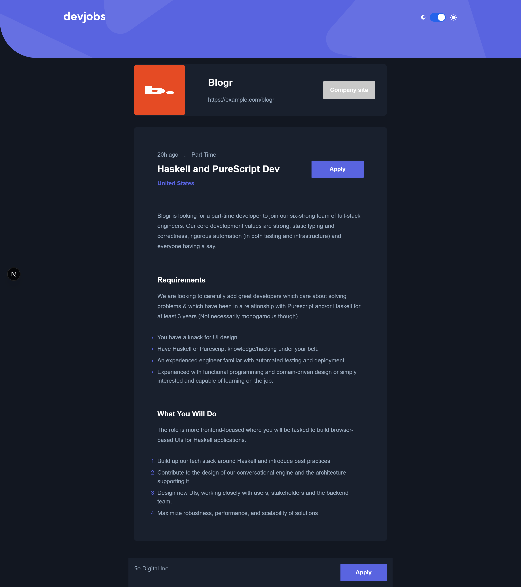
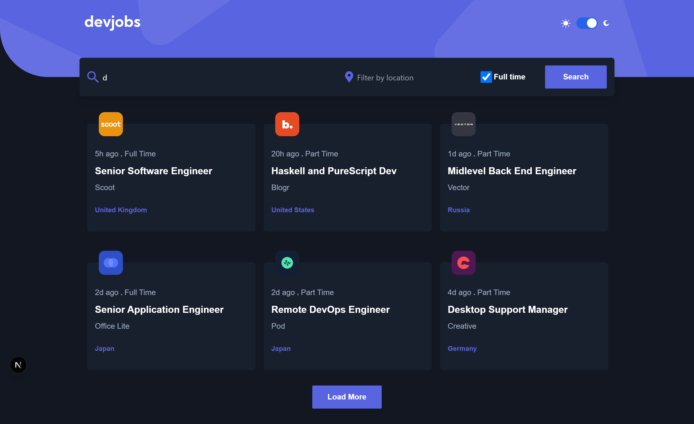

# DevJobs

DevJobs is a job listing platform designed to help job seekers find relevant job opportunities based on their preferences. The app allows users to search and filter job listings by title, location, and employment type (full-time or part-time). The platform aims to simplify the job search process with an easy-to-use interface and real-time data fetching.

## Features

- **Job Search**: Easily search for jobs by title and location.
- **Filter Jobs**: Filter job listings by full-time or part-time employment type.
- **Job Details**: View detailed information about each job, including job title, company name, location, and more.
- **Responsive Design**: A mobile-friendly interface that adapts to various screen sizes.
- **User-Friendly UI**: An intuitive and clean design to enhance the job searching experience.

## Screenshots




## Technologies Used

- **React.js**: JavaScript library for building the user interface.
- **Next.js**: Framework for server-side rendering and static site generation.
- **TypeScript**: A superset of JavaScript that adds static typing to improve code quality.
- **Tailwind CSS**: Utility-first CSS framework for fast and responsive design.
- **Zustand**: To manage state .

## Installation

### Prerequisites

- **Node.js**: Version 14 or above
- **npm**: Package manager for Node.js

### Steps to Set Up

1. Clone the repository to your local machine:

    ```bash
    git clone https://github.com/said-ops/devjobs.git
    cd devjobs
    ```

2. Install dependencies:

    ```bash
    npm install
    ```

3. Start the development server:

    ```bash
    npm run dev
    ```

    The app will be available at `http://localhost:3000` in your browser.

## How It Works

1. **Search Bar**: Users can search for jobs by entering a job title and location in the search bar.
2. **Filters**: Filter jobs based on full-time or part-time status by selecting the appropriate filter options.
3. **Job Cards**: Each job listing is displayed as a card that includes key details like the job title, company name, location, and employment type.
4. **Job Details Page**: Clicking on a job card takes the user to a detailed page with more information about the job.


